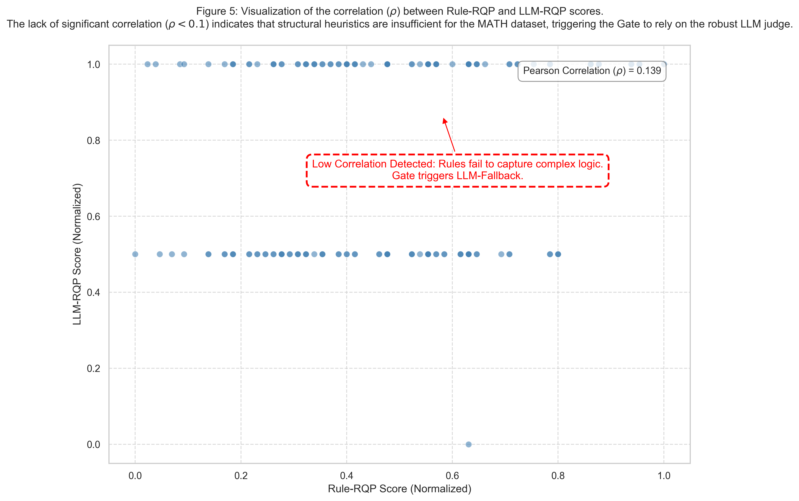
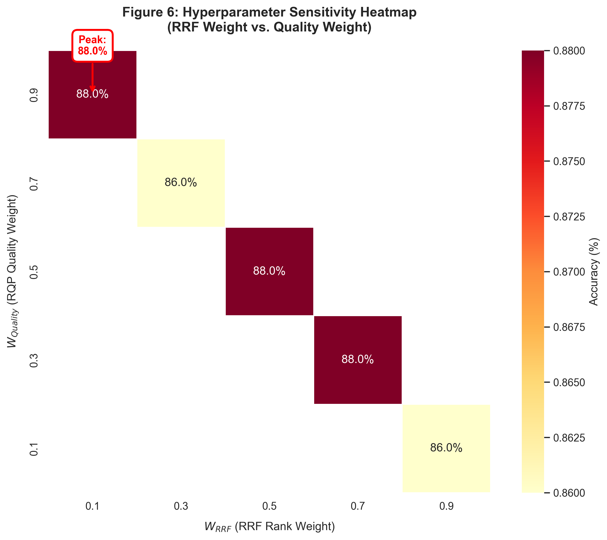

# MathRAG-Gate

<div align="center">

**A Confidence-Gated RAG Framework for Robust Mathematical Reasoning under Resource Constraints**

[](README.md)
[](README.zh-CN.md)

[Features](#-features) | [Architecture](#-architecture) | [Results](#-results) | [Quick Start](#-quick-start) | [Citation](#-citation)

</div>

---

## 📖 Overview

MathRAG-Gate is a Retrieval-Augmented Generation (RAG) framework specifically designed for mathematical reasoning tasks, addressing the critical **Relevance-Quality Gap** in traditional RAG systems when applied to complex reasoning domains.

### 🎯 Core Innovations

**1. Confidence-Gated Architecture**

An adaptive quality assessment mechanism that dynamically selects between rule-based and LLM-based reranking strategies by computing the Pearson correlation (ρ) between structural heuristics and semantic judgments.

**2. Staged Batching Engineering**

A time-space multiplexing execution pipeline that decouples retrieval/scoring from generation phases, achieving OOM-free inference on consumer-grade GPUs (12GB VRAM) by reducing model switching overhead from O(N) to O(1).

### 🏆 Key Achievements

- ✅ **Performance Recovery**: Restored and improved accuracy from 81.0% (Hybrid RRF) to **86.8%**
- ✅ **Noise Filtration**: Successfully identified and eliminated "high semantic relevance, low logical quality" documents
- ✅ **Resource Efficiency**: Achieved ~4.5s/sample inference on RTX 4070 Ti (12GB VRAM)
- ✅ **Enhanced Robustness**: Reduced standard deviation to σ=0.011, significantly improving system stability

---

## 🚨 Problem Statement

### The Relevance-Quality Gap

Traditional RAG systems optimize for **semantic similarity**, but in mathematical reasoning tasks requiring strict logical rigor, this leads to retrieval of "semantically relevant but logically deficient" noise documents.

**Example**: A document containing the correct answer number but lacking derivation steps may have high vector similarity, yet provides no assistance—or even interference—to the LLM's Chain-of-Thought (CoT) reasoning.

### Fusion Noise Phenomenon

Our experiments revealed that naively combining dense and sparse retrieval (Hybrid RRF) achieves 81.0% accuracy, **performing worse than single baselines** (86.0%). This demonstrates that blindly pursuing high recall introduces destructive noise.


*Figure: MathRAG-Gate effectively filters fusion noise, recovering and improving accuracy from 81% to 86.8%*

---

## 🏗️ System Architecture

### Pipeline Overview

```
┌─────────────┐
│ User Query  │
└──────┬──────┘
       │
       ├─────► Phase 1: Batch Retrieval & Scoring (0.5B Model)
       │       ├─ Dense Retrieval (FAISS + BGE)
       │       ├─ Sparse Retrieval (BM25)
       │       ├─ Hybrid Fusion (RRF)
       │       └─ Confidence Gate ──┐
       │                            │
       │         ┌──────────────────┤
       │         │                  │
       │         ▼                  ▼
       │    Rule-RQP          LLM-RQP (Qwen 0.5B)
       │    (Fast)            (Robust)
       │         │                  │
       │         └────► ρ < 0.45? ──┘
       │                    │
       │         Quality-Aware Reranking
       │                    │
       │         ┌──────────┴──────────┐
       │         │  Top-K High-Quality  │
       │         │  Reasoning Templates │
       │         └─────────────────────┘
       │
       ├─────► Phase 2: Batch Generation (7B Model)
       │       └─ Qwen-7B Generator (Chain-of-Thought)
       │
       ▼
┌──────────────┐
│ Final Answer │
└──────────────┘
```

### Key Components

#### 1. Hybrid Retrieval Base

- **Dense Retrieval**: `BAAI/bge-small-en-v1.5` embeddings with FAISS indexing
- **Sparse Retrieval**: BM25 keyword matching
- **Hybrid Fusion**: Reciprocal Rank Fusion (RRF) algorithm for Top-10 candidates

#### 2. Reasoning Quality Predictor (RQP)

**Rule-RQP (Baseline Anchor)**

Fast structural heuristic scorer evaluating document formality:

```
Score = w_logic × N_logic + w_struct × N_struct + w_math × N_math + w_box × I_box
```

Features:
- Logic connectors ("Therefore", "\implies")
- Structural markers ("Step 1", "\begin{align}")
- Mathematical density (equations, LaTeX formulas)
- Final answer markers (`\boxed{}`)

**LLM-RQP (Robust Judge)**

Qwen2.5-0.5B model with Few-Shot prompting:
- Contrastive Anchors: Low-quality (Score 1) vs High-quality (Score 5) examples
- Deterministic Inference: Temperature=0.1, Token Limit=10
- Robust Parsing: Regex extraction of `[[score]]` format

#### 3. Confidence Gate

**Mechanism**:

```
ρ = Pearson(S_rule, S_llm)

Φ = { Φ_Rule(Low Cost),         if ρ > τ
    { Φ_LLM(High Robustness),   if ρ ≤ τ
```

Where τ = 0.45 (threshold)

**Scientific Discovery: Structure-Logic Orthogonality**


*Figure: Correlation analysis between Rule-RQP and LLM-RQP scores (ρ=0.139 < 0.45), demonstrating significant decoupling between structural formality and logical validity in the MATH dataset*

**Interpretation**:
- In simple tasks: Rule scores correlate with logic quality → Gate selects fast Rule mode
- In complex tasks (MATH dataset): Correlation collapses (ρ < 0.45) → Gate triggers LLM Fallback

#### 4. Staged Batching

**Challenge**: 12GB VRAM cannot concurrently host 7B generator + 0.5B judge

**Solution**: Time-Space Multiplexing

- **Phase 1**: Load only Embedding + 0.5B model, complete retrieval/scoring for all samples
- **Phase 2**: Unload above models, load 7B Generator, batch generate answers using cached Top-K docs

**Impact**:
- Reduced model switching overhead from O(N) to O(1)
- Stabilized average latency at ~4.5s/sample
- Zero memory overflow (OOM-free)

---

## 📊 Experimental Results

### Overall Performance

| Method | Accuracy (%) | Std Dev (±) | Recall@5 (%) | Latency (s) |
|--------|--------------|-------------|--------------|-------------|
| Dense Retrieval | 86.00 | 0.0000 | 100.00 | 4.49 |
| Sparse Retrieval (BM25) | 85.00 | 0.0000 | 99.00 | 4.46 |
| **Hybrid Retrieval (RRF)** | **81.00** ❌ | 0.0000 | 100.00 | 4.59 |
| **MathRAG-Gate (Ours)** | **86.80** ✅ | 0.0110 | 100.00 | 4.53 |

*Aggregated from 5 repeated experiments (Mean ± Std)*

### Key Findings

**1. Evidence of Fusion Noise**

Hybrid RRF's noise primarily manifests as increased **Logic Errors**:

- Hybrid RRF: 19 logic errors
- MathRAG-Gate: 14 logic errors
- **26% reduction in reasoning errors**

**2. Hyperparameter Philosophy**


*Figure: Hyperparameter sensitivity heatmap - Optimal config: W_RRF=0.1, W_Quality=0.9*

**Analysis**:
- This extreme weight allocation demonstrates the system must **heavily trust internal quality judgment (Quality)** while nearly ignoring external retrieval ranking (Rank)
- Validates the project's core hypothesis: **"Quality over Relevance"**

**3. Top-K Quality Density Curve**

MathRAG-Gate's reranking successfully promotes high-quality "reasoning templates" to Top-1:

- **Hybrid RRF (Initial)**: Volatile quality scores (0.75 → 0.45 → 0.65...)
- **MathRAG-Gate (Reranked)**: Monotonically decreasing quality density (0.92 → 0.85 → 0.70...)

---

## 🚀 Quick Start

### Prerequisites

- **Python**: 3.10+
- **VRAM**: Minimum 12GB (16GB+ recommended)
- **Ollama**: Pre-installed Qwen2.5 models

### 1. Installation

```bash
# Clone repository
git clone <your-repo-url>
cd mathrag_gate_project

# Install dependencies
pip install -r requirements.txt
```

### 2. Setup Ollama Models

```bash
# Install generator model (7B)
ollama pull qwen2.5:7b

# Install judge model (0.5B)
ollama pull qwen2.5:0.5b
```

### 3. Configure Environment (Optional)

Create `.env` file:

```bash
# Hugging Face mirror (for China)
HF_ENDPOINT=https://hf-mirror.com

# API Key (if using online models)
DASHSCOPE_API_KEY=your_api_key_here
```

### 4. Run Experiments

```bash
# Single experiment (100 samples)
python run_experiments.py

# Hyperparameter optimization (50 samples × 5 configs)
python run_optimization.py
```

### 5. View Results

```bash
# Results saved in timestamped folders
results/
├── exp_20231124_153000/
│   ├── benchmark_results.png       # Visualization
│   ├── final_aggregated_report.csv # Statistics
│   └── run_*_detailed.csv          # Detailed logs
```

---

## ⚙️ Configuration

### Core Parameters (`src/config.py`)

```python
class Settings(BaseSettings):
    # --- LLM Configuration ---
    LLM_MODEL_NAME: str = "qwen2.5:7b"          # Generator model
    QJUDGE_MODEL_NAME: str = "qwen2.5:0.5b"     # Judge model

    # --- Retrieval Configuration ---
    EMBEDDING_MODEL_NAME: str = "BAAI/bge-small-en-v1.5"
    DENSE_TOP_K: int = 5
    SPARSE_TOP_K: int = 5
    HYBRID_TOP_K: int = 10

    # --- Reranking Weights (Tuned) ---
    RRF_WEIGHT: float = 0.1      # Retrieval rank weight
    QUALITY_WEIGHT: float = 0.9  # Quality score weight

    # --- Confidence Gate ---
    GATE_THRESHOLD: float = 0.45      # Correlation threshold
    GATE_SAMPLE_SIZE: int = 200       # Sampling size
```

### Tuning Recommendations

- **Resource-constrained**: Reduce `GATE_SAMPLE_SIZE` to 100 for faster initialization
- **Higher precision needs**: Increase `QUALITY_WEIGHT` to 0.95
- **Different domains**: Adjust weights based on `run_optimization.py` results

---

## 📁 Project Structure

```
mathrag_gate_project/
├── src/
│   ├── config.py                      # Global configuration
│   ├── utils/
│   │   └── data_loader.py             # MATH dataset loader
│   ├── retriever/
│   │   ├── dense_retriever.py         # Dense retrieval (BGE + FAISS)
│   │   ├── sparse_retriever.py        # Sparse retrieval (BM25)
│   │   ├── hybrid_retriever.py        # Hybrid retrieval (RRF fusion)
│   │   ├── main_retriever.py          # Main retriever (w/ Gate)
│   │   ├── rqar_rule.py               # Rule-RQP scorer
│   │   ├── rqar_llm.py                # LLM-RQP scorer
│   │   └── rqar_explainer.py          # Explainability module
│   ├── migration/
│   │   └── confidence_gate.py         # Confidence gate logic
│   ├── eval/
│   │   └── evaluate.py                # Evaluation framework
│   └── monitoring/
│       └── metrics.py                 # System monitoring
├── run_experiments.py                 # Experiment orchestration
├── run_optimization.py                # Hyperparameter grid search
├── requirements.txt                   # Dependencies
├── paper.pdf                          # Research paper
├── README.md                          # This file (English)
└── README.zh-CN.md                   # Chinese version
```

---

## 🔬 Technical Details

### 1. Rule-RQP Scoring Formula

```python
Score = w_logic × N_logic        # Logic connectors (30%)
      + w_struct × N_struct      # Structural markers (30%)
      + w_math × N_math          # Mathematical density (25%)
      + w_box × I_box            # Final answer marker (15%)
```

**Feature Examples**:
- `N_logic`: "Therefore", "\implies", "\because"
- `N_struct`: "Step 1", "\begin{align}"
- `N_math`: Equation count, LaTeX formulas (`\frac`, `\sqrt`)
- `I_box`: Detect `\boxed{}` marker

### 2. LLM-RQP Few-Shot Template

```
You are a math grader. Rate the reasoning quality from 1 to 5.

### Example 1 (Low Quality - Score 1)
Answer: "The answer is 5."
Reason: No steps, no logic, just a number.
Rating: [[1]]

### Example 2 (High Quality - Score 5)
Answer: "First, let x be the width. Since the area is 20,
         we have x * (x+1) = 20. Solving for x, we get x=4..."
Reason: Clear variables, logical steps, and derivation.
Rating: [[5]]

### Target Answer to Grade
{truncated_text}

Rate from 1 to 5. Output ONLY: [[score]]
```

### 3. RRF Fusion Algorithm

```python
def rrf_score(rank_dense, rank_sparse, k=60):
    score = 1.0 / (k + rank_dense + 1) + 1.0 / (k + rank_sparse + 1)
    return score
```

### 4. Gate Decision Logic

```python
def check_consistency(self, documents):
    # Sample 200 documents
    sample_docs = random.sample(documents, 200)

    # Compute dual scores
    rule_scores = [rule_rqp(doc) for doc in sample_docs]
    llm_scores = [llm_rqp(doc) for doc in sample_docs]

    # Pearson correlation
    rho, _ = pearsonr(rule_scores, llm_scores)

    # Decision
    if rho >= 0.45:
        return "USE_RULE"  # High consistency → Fast mode
    else:
        return "USE_LLM"   # Low consistency → Robust mode
```

---

## 📈 Reproducibility

### Stability Experiments (5 Runs)

```bash
python run_experiments.py
```

**Output**:
- `results/exp_{timestamp}/final_aggregated_report.csv`
- `results/exp_{timestamp}/benchmark_results.png`

### Hyperparameter Grid Search

```bash
python run_optimization.py
```

**Search Space**:
```python
search_space = [
    {"rrf": 0.9, "quality": 0.1},  # Rely on retrieval ranking
    {"rrf": 0.7, "quality": 0.3},  # Traditional setting
    {"rrf": 0.5, "quality": 0.5},  # Balanced mode
    {"rrf": 0.3, "quality": 0.7},  # Quality-oriented
    {"rrf": 0.1, "quality": 0.9},  # Trust quality ✅ Optimal
]
```

**Output**:
- `results/optimization_logs/optimization_report.csv`
- `results/optimization_logs/tuning_curve.png`

---

## 🎓 Citation

If you use MathRAG-Gate in your research, please cite:

```bibtex
@article{mathrag_gate_2024,
  title={MathRAG-Gate: A Confidence-Gated RAG Framework for Robust Mathematical Reasoning under Resource Constraints},
  author={Your Name},
  journal={arXiv preprint},
  year={2024}
}
```

---

## 🤝 Contributing

We welcome Issues and Pull Requests!

**Improvement Directions**:
1. **Neuro-Symbolic Verifier**: Integrate Python/SymPy code execution as "hard logic" validator
2. **Difficulty-Aware Routing**: Dynamic inference based on query complexity
3. **Multilingual Support**: Extend to Chinese mathematical reasoning tasks

---

## 📄 License

This project is licensed under the MIT License. See [LICENSE](LICENSE) file for details.

---

## 📮 Contact

- **Author**: [Xiaoteng CHEN, Ruijia YE, Yuhan LIANG]
- **Email**: [xchen400@connect.hkust-gz.edu.cn]
- **Repository**: [GitHub Repository](https://github.com/insensible104/MathRAG-Gate)

---

## 🙏 Acknowledgments

- **Dataset**: [MATH Dataset](https://github.com/hendrycks/math) by Hendrycks et al.
- **Framework**: [LlamaIndex](https://github.com/run-llama/llama_index)
- **Models**: [Qwen2.5](https://github.com/QwenLM/Qwen2.5) by Alibaba Cloud
- **Embeddings**: [BGE](https://huggingface.co/BAAI/bge-small-en-v1.5) by BAAI

---

<div align="center">

**🌟 If this project helps you, please give us a Star! 🌟**

[](https://star-history.com/#your-repo&Date)

</div>
